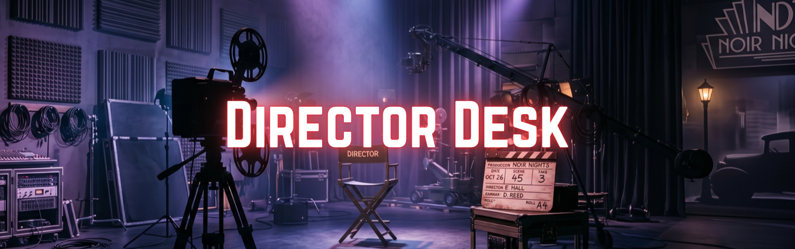
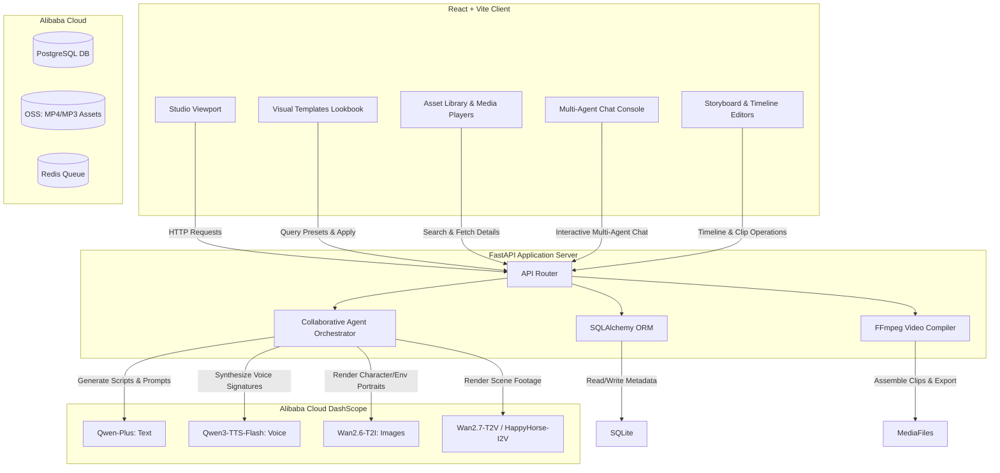

# Director Desk 🎬 — Track 2: AI Showrunner



Director Desk is an advanced, production-grade **AI Showrunner and Creative Director Platform** that automates cinematic storytelling. From screenwriting and multi-agent character casting to environment design, voice directing, video generation, and final video assembly, Director Desk orchestrates the entire creative lifecycle under a unified dashboard.

Designed for creators, filmmakers, and AI artists, the platform features a collaborative AI crew, visual presets lookbooks, interactive asset libraries, and non-destructive post-production editors.

---

## 🏗️ System Architecture & Workflow

The diagram below details how the Vite frontend interacts with the FastAPI backend, local SQLite database storage, and external AI generation services.



---

## 🌟 Key Features

### 1. Cinematic Studio Dashboard
*   **Creative Parameters Console:** Specify Lenses (e.g., Anamorphic Prime, Vintage Spherical), Lighting configurations (e.g., volumetric fog, soft window key), Color profiles (e.g., Teal & Orange, Silver Halide), Camera styles (e.g., zero-gravity drift, vertical crane sweeps), and Aspect Ratios.
*   **Volumetric Environment Visuals:** Designed with dark mode softness, volumetric drifting lens flares, and interactive film grain overlay filters to mimic a premium movie editing suite.

### 2. Collaborative AI Agents Workspace
*   **Multi-Agent Playground:** Enter the agents dashboard to direct a specialized 5-member production crew:
    *   ✍️ **Screenplay Agent:** Generates, parses, and formats screenplays into production-ready segments.
    *   🎭 **Casting Agent:** Designs rich characters, age groups, attire, and demeanor profiles.
    *   🌍 **Location Scout Agent:** Creates setting architecture, lighting, and environmental concepts.
    *   🎙️ **Voice Director Agent:** Adjusts voice models, speeds, language, and speaker signature controls.
    *   🎥 **Video Renderer Agent:** Translates visual cues into prompt instructions for scene generators.
*   **Interactive Chat Sandbox:** Engage in real-time dialog with any agent inside a deep console featuring purple action controls, small textbox input segments, and user/agent status avatars.
*   **Agent Reference Manual:** Fully detailed sidebar manual describing what each agent accomplishes and how they interact.

### 3. Visual Presets & Templates Library
*   **3-Column Vertical Grid Lookbook:** Clean, full-width grid layout of cinematic presets (e.g., Cyberpunk, Cinematic Noir, Sci-Fi Metropolis, Documentary Realism, Space Odyssey) that fits the screen width perfectly.
*   **Hover-Play Video Previews:** Hovering over any template card automatically streams a muted, looping preview video clip to visualize the template's mood.
*   **Always-Visible Specs:** View detailed technical specifications and cinematic film inspirations directly on the card bodies.
*   **Instant Application:** Clicking "Apply Preset Style" redirects the user to the studio dashboard, auto-configuring aspect ratios, camera settings, and inserting a random, highly detailed cinematic prompt into the text area without auto-submitting.
*   **Custom Templates:** Create and delete custom style presets on the fly, persistent in the SQLite database.

### 4. Unified Asset Library
*   **Filter Tabs:** Instantly filter assets by Characters, Environments, Voices, and Videos. Tab texts are globally optimized for Day and Night modes.
*   **Click-To-Expand Animations:** Click any asset card to slide open detailed specifications with CSS transitions (`max-h-96 duration-500`):
    *   *Characters:* Detailed Gender, Age Group, Ethnicity, Attire/Appearance, Personality Traits, and visual prompts.
    *   *Environments:* Time of Day, Lighting setups, Atmosphere details, and architecture presets.
    *   *Voices:* Speaker age/gender targets and model signature definitions with an inline audio controller.
*   **Unified Search & Selector:** Query assets across all parameters or isolate items by project.

### 5. Non-Destructive Storyboard Editor
*   **Script & Scene Timeline:** Live script edit boxes, storyboard card lists, aspect ratio selectors, and delete options.
*   **Video Compiler & Export:** Fully functional FFmpeg video compiler with a dedicated overlay modal video player.

---

## 🛠️ Tech Stack

*   **Frontend:** React 18, Vite, Tailwind CSS, Lucide / React Icons
*   **Backend:** FastAPI (Python), SQLite (Local Database), SQLAlchemy ORM
*   **Integrations:** Qwen Multi-Modal APIs (Alibaba Cloud DashScope: Qwen-Plus, Wan2.6-T2I, Wan2.7-T2V, HappyHorse-I2V, Qwen3-TTS-Flash), FFmpeg (Video Compilation & Assembly)

---

## 🚀 Run Locally

### Prerequisites
*   Node.js (v18+)
*   Python (v3.10+)

### Setup Instructions

#### 1. Clone the Repository
```bash
git clone https://github.com/Supan-Roy/director-desk.git
cd director-desk
```

#### 2. Backend Installation & Setup
1. Navigate to the `backend/` directory:
   ```bash
   cd backend
   ```
2. Create and activate a Python virtual environment:
   ```bash
   python -m venv .venv
   # Windows:
   .venv\Scripts\activate
   # macOS/Linux:
   source .venv/bin/activate
   ```
3. Install the dependencies:
   ```bash
   pip install -r requirements.txt
   ```
4. Configure environment variables:
   *   Copy `.env.example` to `.env`.
   *   Set database URLs and API keys (e.g., Qwen API tokens, OpenAI tokens) as needed.
5. Launch the FastAPI server:
   ```bash
   uvicorn app.main:app --reload --port 8000
   ```

#### 3. Frontend Installation & Setup
1. Open a new terminal and navigate to the `frontend/` directory:
   ```bash
   cd frontend
   ```
2. Install dependencies:
   ```bash
   npm install
   ```
3. Configure environment variables:
   *   Copy `.env.example` to `.env` (ensure `VITE_API_BASE_URL` points to your backend: `http://localhost:8000`).
4. Start the dev server:
   ```bash
   npm run dev
   ```

Open your browser and navigate to `http://localhost:5173` to enter the Director Desk studio.

---

## 👥 Credits

**Developed by - Supan Roy**
redits

**Developed by - Supan Roy**
